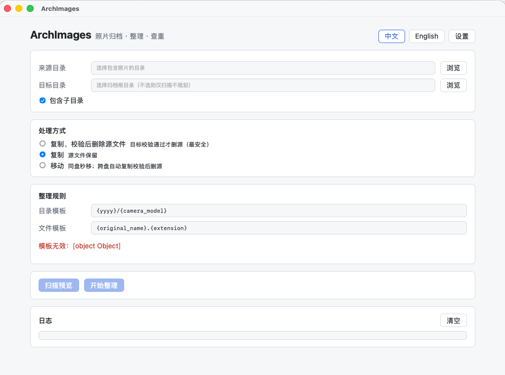
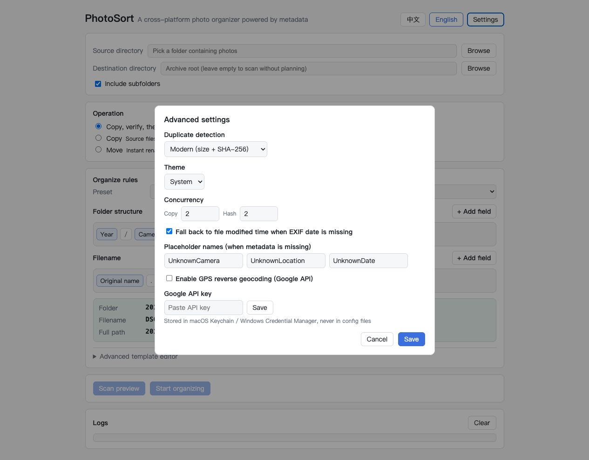

# PhotoSort

[English](README.md) | [中文](README.zh-CN.md)

A cross-platform photo organizer powered by metadata.

**Design principle: data safety first, performance second.** Scanning and planning never write to disk. Source files are deleted only after all four guarantees pass: copy complete, target exists, size matches, hash matches. A full transaction journal enables crash recovery.



*Main interface — select source/destination, configure templates, preview before organizing.*



*Advanced settings — duplicate detection mode, concurrency, EXIF fallback, GPS reverse geocoding with secure API key storage.*

## Features

- **Recursive scanning** with a verified extension allowlist (nom-exif + rawler coverage)
- **EXIF metadata** via a dual-engine pipeline: `nom-exif` for standard images (JPEG/HEIC/HEIF/AVIF/TIFF/CR3/RAF/IIQ), `rawler` for camera RAW (NEF/CR2/ARW/DNG...), with an optional ExifTool runtime fallback
- **Template engine** for directory and filename rules (`{yyyy}/{camera_model}/{gps_city}`, `{yyyyMMdd}_{HHmmss}_{seq:4}`, etc.) with a concurrency-safe sequence coordinator
- **Read-only preview** before any file is touched — plan and execute share the exact same pipeline
- **Duplicate detection** using SHA-256 content hashing
- **Safe file operations**: atomic copy (temp + fsync + rename), safe move (rename with cross-device fallback), copy-verify-delete with four-way verification before source removal
- **Background jobs** with bounded worker pools, progress events, and cooperative cancellation
- **SQLite persistence** for hash cache, GPS cache, and job journaling with crash recovery
- **Google Maps reverse geocoding** (optional) with OS-native credential storage (Keychain / Credential Manager), graceful degradation when no API key is configured
- **Cross-platform path safety** — sanitizes reserved names, invalid characters, path traversal, and length limits
- **Internationalization** — English and Simplified Chinese

## Template System

PhotoSort uses a flexible template engine to define how photos are organized into directories and renamed. Templates use `{variable}` syntax, parsed by a dedicated tokenizer (not simple string replacement) to avoid ambiguity.

### Available Variables

#### Date & Time

| Variable | Description | Example |
|---|---|---|
| `{yyyy}` | Year (4 digits) | `2017` |
| `{MM}` | Month (2 digits) | `11` |
| `{dd}` | Day (2 digits) | `30` |
| `{yyyyMMdd}` | Full date | `20171130` |
| `{yyyy-MM-dd}` | Date with dashes | `2017-11-30` |
| `{HH}` | Hour (24h) | `15` |
| `{mm}` | Minute | `22` |
| `{ss}` | Second | `31` |
| `{HHmmss}` | Time | `152231` |

#### Camera & Lens

| Variable | Description | Example |
|---|---|---|
| `{camera_make}` | Camera manufacturer | `NIKON CORPORATION` |
| `{camera_model}` | Camera model | `NIKON D80` |
| `{lens_make}` | Lens manufacturer | `NIKON` |
| `{lens_model}` | Lens model | `18-135mm F3.5-5.6` |

#### GPS / Location

| Variable | Description | Example |
|---|---|---|
| `{gps_country}` | Country | `China` |
| `{gps_province}` | Province / State | `Guangdong` |
| `{gps_city}` | City | `Hong Kong` |
| `{gps_district}` | District | `Central` |

#### File

| Variable | Description | Example |
|---|---|---|
| `{original_name}` | Original filename (without extension) | `DSC_1231` |
| `{extension}` | File extension | `JPG` |
| `{seq}` | Sequence number (auto-incremented) | `1` |
| `{seq:4}` | Zero-padded sequence (width 1–10) | `0001` |

### Directory Template Examples

The directory template defines the folder structure under the destination root. Use `/` to separate levels.

```
{yyyy}/{camera_model}
→ 2017/NIKON D80/

{yyyy}/{gps_city}/{camera_model}
→ 2017/Hong Kong/NIKON D80/

{yyyy}/{yyyyMMdd}/{camera_model}
→ 2017/20171130/NIKON D80/

{yyyy}/{yyyy-MM-dd}/{camera_model}/{lens_model}
→ 2017/2017-11-30/NIKON D80/18-135mm F3.5-5.6/
```

### Filename Template Examples

The filename template defines the final filename (without directory path).

```
{original_name}.{extension}
→ DSC_1231.JPG

{yyyyMMdd}_{HHmmss}.{extension}
→ 20171130_152231.JPG

{yyyyMMdd}_{HHmmss}_{seq:4}.{extension}
→ 20171130_152231_0001.JPG

{original_name}_{yyyyMMdd}.{extension}
→ DSC_1231_20171130.JPG

{seq:5}.{extension}
→ 00001.JPG
```

### Rules

- `{seq}` is **only allowed in filename templates** (not directory templates) — directory sequence numbers are non-deterministic and forbidden.
- Sequence numbers are scoped per destination directory and allocated by a concurrency-safe coordinator, guaranteeing uniqueness even with parallel workers.
- Use `{{` and `}}` to output literal curly braces, e.g. `{{literal}}` → `{literal}`.
- Missing metadata automatically falls back to configurable names (default: `UnknownCamera`, `UnknownLocation`, `UnknownDate`). These can be customized in Settings.
- All path components are sanitized for cross-platform safety: Windows reserved names (`CON`, `PRN`, `NUL`, etc.), invalid characters (`< > : " / \ | ? *`), trailing dots/spaces, and path traversal (`../`) are all handled.

## Tech Stack

| Layer | Technology |
|---|---|
| Frontend | Vue 3, TypeScript, Vite, Pinia, vue-i18n |
| Backend | Rust, Tauri 2, Tokio, rusqlite, nom-exif, rawler |
| Hashing | sha2, sha1, md-5 (RustCrypto, single-pass multi-hasher) |
| HTTP | reqwest (rustls-tls, no OpenSSL dependency) |
| Secrets | keyring (OS-native Keychain / Credential Manager) |

End users need **zero runtime dependencies** — no Python, ExifTool, Node, JVM, or .NET required after installation.

## Project Structure

```
archimages/
├── src/                      # Vue 3 frontend
│   ├── components/           # DirectoryPicker, RuleEditor, ScanResultTable, ...
│   ├── views/                # MainView (orchestrator)
│   ├── stores/               # Pinia: settings, scan, task, log
│   ├── types/                # TypeScript DTOs mirroring Rust models
│   ├── services/             # tauri.ts — centralized IPC
│   └── i18n/                 # en, zh-CN
└── src-tauri/
    └── src/
        ├── commands/         # Tauri IPC: scan, organize, settings, jobs, geocode
        ├── core/              # scanner, metadata, template, planner, hash,
        │                     # duplicate, file_ops, organizer, task_manager,
        │                     # geocode, api_key
        ├── db/               # schema, hash_cache, gps_cache, jobs
        ├── models/            # PhotoFile, PhotoMetadata, PhotoPlan, ...
        ├── config/            # JsonSettingsStore
        ├── error/             # AppError (thiserror, i18n keys)
        └── utils/             # path safety, logging
```

## Development

### Prerequisites

- [Node.js](https://nodejs.org/) 20+
- [Rust](https://www.rust-lang.org/) stable toolchain
- Platform Tauri prerequisites:
  - **macOS**: Xcode Command Line Tools
  - **Linux**: `libwebkit2gtk-4.1-dev libgtk-3-dev librsvg2-dev patchelf`
  - **Windows**: MSVC build tools

### Run

```bash
cd archimages
npm install
npm run tauri dev
```

### Quality Gates

Run before every commit:

```bash
# Frontend
npm run typecheck
npm run test
npm run build

# Backend
cd src-tauri
cargo fmt --check
cargo clippy --all-targets -- -D warnings
cargo test
```

### Integration Tests with codec-corpus

Integration tests use real images from [imazen/codec-corpus](https://github.com/imazen/codec-corpus). Download test data (not committed to git):

```bash
./tests/download_codec_corpus.sh
cd archimages/src-tauri && cargo test --test codec_corpus
```

## Build & Distribute

```bash
cd archimages
npm run tauri build
```

Produces platform-native bundles:
- **Windows**: NSIS installer (`.exe`)
- **macOS**: `.app` bundle and `.dmg` (Apple Silicon + Intel)

Current releases are **unsigned beta** builds. Code signing (Authenticode / Apple Developer ID) and notarization will be configured in a later release.

On macOS, unsigned builds downloaded from a browser may show a "damaged" or "cannot be opened" warning. If you trust the downloaded release asset, remove the quarantine attribute before launching:

```bash
xattr -dr com.apple.quarantine /Applications/PhotoSort.app
```

## CI

GitHub Actions (`.github/workflows/ci.yml`) runs on every push and pull request:
1. **Quality** (Ubuntu) — fmt, clippy, test, typecheck, frontend build
2. **Build Windows** (x64) — NSIS `.exe` artifact
3. **Build macOS** (Apple Silicon + Intel) — `.app` + `.dmg` artifacts

## Security Notes

- The Google Maps API key is stored in the OS-native credential store, never in `settings.json` or source code.
- All paths from the frontend are re-validated on the backend; generated targets are confirmed to stay within the destination root (no `../` escape).
- Hash failures never result in source deletion — when in doubt, the application keeps both files.

## License

[MIT License](LICENSE)
